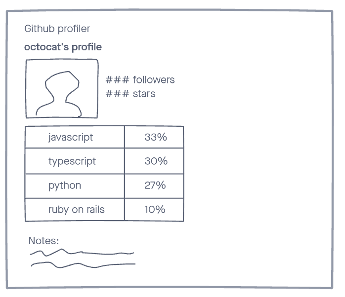

# AE Studio's exercise

Below is the AE Studio's exercise. This exercise is designed to give our team a chance to assess your skills and let you have fun collaborating on a cool little project.

You can find [GitHub's API documentation in here](https://docs.github.com/en/rest), you **won't** be needing an API key for this exercise.

# GitHub profiler

Input

Loading

Show parsed data

# Instructions

In this exercise you're going to build a tool that gives insights on someone's GitHub profile.

- feel free to use Google, Stack Overflow or anything else you want
- feel free to install any packages you think is necessary

# We expect

**In general**:

- **Communication skills**: we want to see if you are capable of communicating and explaining ideas to others
- **Problem solving skills**: we need people who are able to solve the client's problems, come up with solutions and ideas to improve things
- **Coding skills**: we need people who can write code and make things come to life
- **Good practices, organization, architecture, unit tests**: we do care about the quality of our projects and we need to keep them in good shape

# Job

See the [job description on our website](https://ae.studio/join-us).
