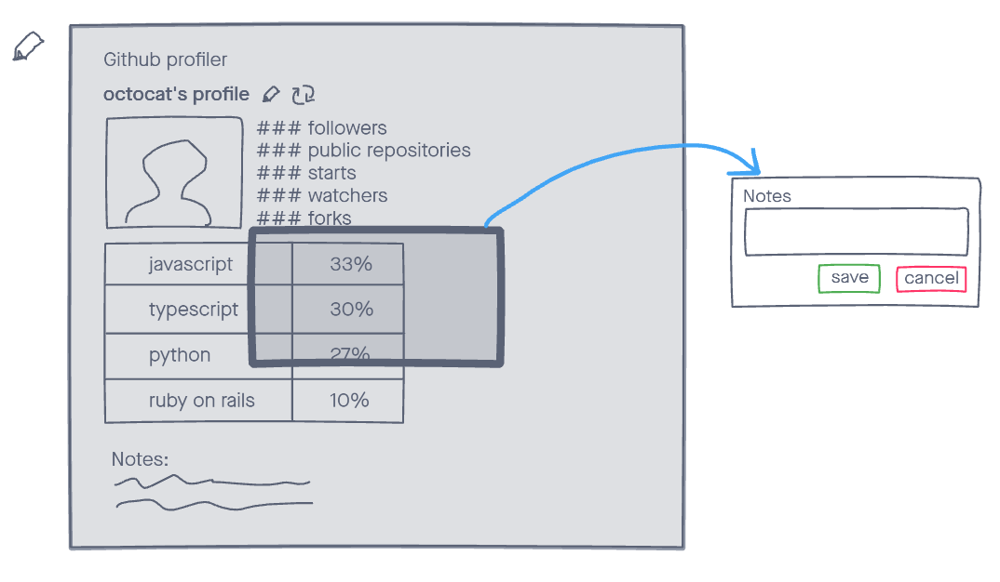

# AE Studio's exercise

Below is the AE Studio's exercise. This exercise is designed to give our team a chance to assess your skills and let you have fun collaborating on a cool little project.

See the [job description on our website](https://ae.studio/join-us).

# Delivering

- Don't fork this, create a new repo from scratch
- When done share a link to your Git repository with us (same email you received a link to this)
- If something isn't clear and you are making some assumptions share them in the README.md

# We expect

**In general**:

- **Communication skills**: we want to see if you are capable of communicating and explaining ideas to others
- **Problem solving skills**: we need people who are able to solve the client's problems, come up with solutions and ideas to improve things
- **Coding skills**: we need people who can write code and make things come to life
- **Style (CSS) and basic UX skills**: we need people who understand at least the basics of design and can come up with something good
- **Good practices, organization, architecture, unit tests**: we do care about the quality of our projects and we need to keep them in good shape

**API**: show us what you know about handling parameters, caching, logging, error handling and anything else.

**CLIENT**: show us what you know about design, presentation, organization, state management and anything else.

# Exercise

In this exercise you're going to build a tool that gives insights on someone's GitHub profile.

See the `docs` folder for mockups.

Estimate and complete the following user stories:

## #1 - User Story: display a page with the user information

as an user of the application
I want to be able to lookup an username from GitHub and see the user information
because I want to know their name, location and see a photo

### ac

- display an input centered on the screen where users can input a username
- add a button that allows the user to get information from GitHub
- display a loading screen while data is being fetched
- display a page showing the user name, photo, location

---

## #2 - User Story: display the GitHub user's numbers

as an user of the application
I want to be able to see the total number of repositories, followers, etc
because I'm curious to know what's their info

### ac

- only count the number of repositories owned by the account that is being looked up; do not count forks

display, in the profile screen, the total number of

- followers
- following
- repositories
- stars from all repositories
- watchers from all repositories
- forks from all repositories

---

## #3 - User Story: display the languages used by the user and the percentage they represent

as an user of the application
I want to be able to see the different languages and how much of each is used in owned repositories
because I want to know if the GitHub user's stack is compatible with what I'm looking for

### ac

- display all languages used by the GitHub user
- display the percentage that they represent across every repository

---

## #4 - User Story: display a field Notes where I can save notes about someone

as an user of the application
I want to be able to save notes in a profile so that when I visit someone's profile at another date I can still see my notes
because I want to keep track of the profiles I saw and considerations I added

### ac

- display a field bellow the profile information that allows me to add text
- display a button Save that allows me to persist my notes for that user

---

# Mockups

