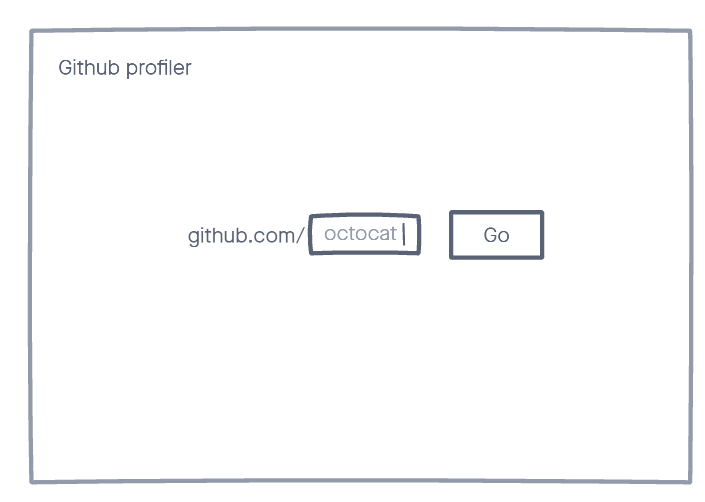
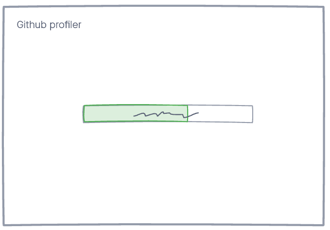

# AE Studio's exercise

Below is the AE Studio's exercise. This exercise is designed to give our team a chance to assess your skills and let you have fun collaborating on a cool little project.

You can find [GitHub's API documentation in here](https://docs.github.com/en/rest), you **won't** be needing an API key for this exercise.

# App

## Rules

- only consider happy paths
- you can call the endpoint as many times as you want for testing
- you can use any framework you want as long as you build an API and a web interface

## Acceptance Criteria

- needs an interface that asks for a input
- need to create a custom API endpoint that returns the total number of stars and the avatar url of the user from the input
- show the user avatar and number of stars on screen
- after you hit both endpoints you can never hit them again
- has to persist if browser restarts
- has to persist if server restarts

## GitHub profiler

Input

Show data

# Job

See the [job description on our website](https://ae.studio/join-us).
