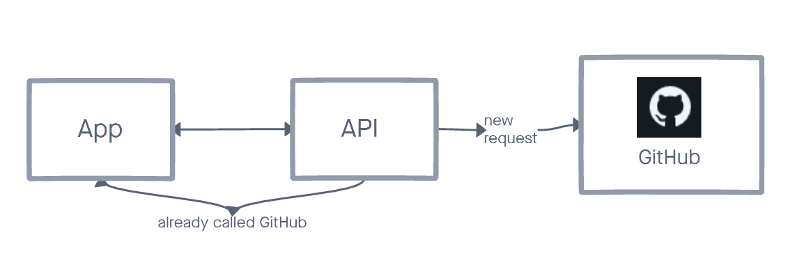

# AE Studio's exercise

Below is the AE Studio's exercise. This exercise is designed to give our team a chance to assess your skills and let you have fun collaborating on a cool little project.

You can find [GitHub's API documentation in here](https://docs.github.com/en/rest), you **won't** be needing an API key for this exercise.

# Job

See the [job description on our website](https://ae.studio/join-us).

# App

## GitHub profiler

Build an application that gets information about a GitHub user from their username. Show their picture and the total number of stars that they have.

### Input

### Show data

## You

- should only consider happy paths (you don't have to handle errors and things like that)
- can use any framework you want as long as you build an API and a web interface
  - need to create a custom API endpoint that returns the total number of stars and the avatar url
  - need to create an interface that asks for an input
- should only call the GitHub API if you haven't already called it for that user
  - a request for the same user should return data stored by your API rather than generating a new request to GitHub
  - the data has to persist if you change browsers
  - the data has to persist if server restarts
- should show the user avatar and number of stars on screen

