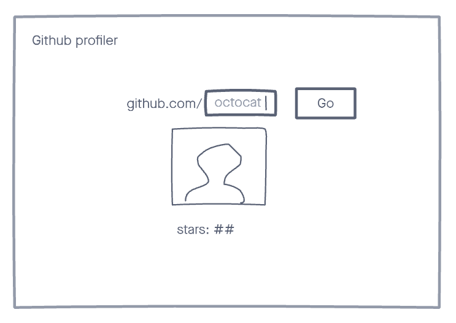

# LC

This exercise is designed to give our team a chance to assess your skills and let you have fun collaborating on a cool little project.

You can find [GitHub's API documentation in here](https://docs.github.com/en/rest), you **won't** be needing an API key for this exercise.

# Job

See the [job description on our website](https://ae.studio/join-us).

# App

## GitHub profiler

Build an application that gets information about a GitHub user from their username. Show their picture and the total number of stars that they have.

### Input

### Show data

